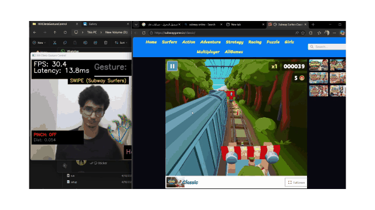
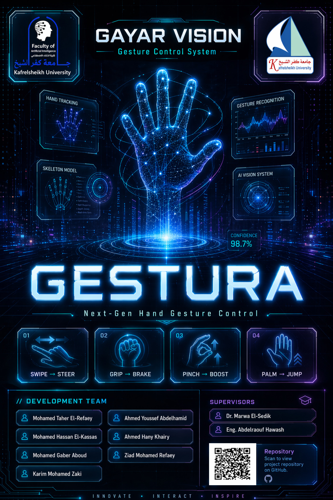

<div align="center">

# Gestura – Real-Time Hand Gesture Game Controller

A computer vision project that allows users to control games using real-time hand gestures through a webcam.


</div>

## Demo

<p align="center">
  <a href="https://github.com/MohamedxTaher/gestura/blob/main/assets/demo/gestura-demo.mp4">
    
  </a>
</p>

<p align="center">
  <a href="https://github.com/MohamedxTaher/gestura/blob/main/assets/demo/gestura-demo.mp4">Open the Full Demo Video on GitHub</a>
</p>

## Project Poster

<p align="center">
  
</p>

<p align="center">
  <a href="assets/poster/gestura-poster.png">View Full Poster</a>
</p>

## Presentation Website

A premium interactive website was created for the university project showcase.

- [Open Presentation Website](presentation/index.html)
- [Demo Video](presentation/assets/media/gestura-demo.mp4)
- [Project Poster](presentation/assets/poster/gestura-poster.png)
- [Gesture Guide](presentation/assets/gestures/gesture-guide.svg)

## Overview

Gestura uses a webcam to detect hand landmarks in real time, recognizes predefined hand gestures, and converts them into keyboard or mouse actions for game control. It uses MediaPipe for hand landmark detection, OpenCV for camera processing, and a rule-based gesture classification/control layer for translating gestures into actions.

**Suggested GitHub description:** Real-time webcam hand gesture controller for games using OpenCV, MediaPipe, and Python.

**Suggested GitHub topics:** `computer-vision`, `mediapipe`, `opencv`, `hand-tracking`, `gesture-recognition`, `python`, `game-control`, `human-computer-interaction`

## Key Features

- Real-time hand tracking through a webcam
- Rule-based gesture recognition for the control layer
- Keyboard control mode for game actions
- Mouse swipe control mode for directional swipe games
- Game interaction using hand gestures
- Lightweight Python implementation
- Modular project structure

## How It Works

1. Webcam captures video frames.
2. OpenCV processes the camera feed.
3. MediaPipe detects hand landmarks.
4. Rule-based logic recognizes gestures.
5. Pynput converts gestures into keyboard or mouse actions.
6. The game receives the simulated input.

## Gesture Mapping

| Gesture | Mode | Action |
|---|---|---|
| Index Finger | Keyboard Mode | Right Arrow / Move Right |
| Peace Sign | Keyboard Mode | Left Arrow / Move Left |
| Fist | Keyboard Mode | Space / Brake |
| Open Palm | Keyboard Mode | Up Arrow |
| Three Fingers | Keyboard Mode | Down Arrow |
| Pinch + Move Right | Swipe Mode | Swipe Right |
| Pinch + Move Left | Swipe Mode | Swipe Left |
| Pinch + Move Up | Swipe Mode | Jump / Swipe Up |
| Pinch + Move Down | Swipe Mode | Roll / Swipe Down |

## Tech Stack

| Technology | Role |
|---|---|
| Python | Main programming language |
| OpenCV | Webcam capture and frame processing |
| MediaPipe | Real-time hand landmark detection |
| Pynput | Keyboard and mouse input simulation |
| NumPy | Numerical calculations and array operations |

## Project Structure

```text
gestura/
|-- assets/
|   |-- demo/
|   |   |-- gestura-demo-preview.gif
|   |   `-- gestura-demo.mp4
|   `-- poster/
|       `-- gestura-poster.png
|-- config/
|   |-- settings.json
|   `-- gestures_mapping.json
|-- docs/
|   |-- README.md
|   |-- TECHNICAL_REPORT.md
|   `-- USER_GUIDE.md
|-- src/
|   |-- main.py
|   |-- gesture_recognizer.py
|   |-- pinch_swipe_recognizer.py
|   |-- key_controller.py
|   `-- mouse_controller.py
|-- tests/
|-- requirements.txt
|-- run.bat
|-- run.sh
`-- README.md
```

## Installation

```bash
git clone https://github.com/MohamedxTaher/gestura.git
cd gestura
pip install -r requirements.txt
```

## Usage

Run the application from the project root:

```bash
python -m src.main
```

You can also use the included launch scripts:

```bash
# Windows
run.bat

# macOS/Linux
bash run.sh
```

During runtime:

| Key | Action |
|---|---|
| `m` | Toggle between keyboard mode and swipe mode |
| `r` | Reset runtime statistics |
| `q` | Quit the application |

## Use Cases

- Gesture-based game control
- Human-computer interaction
- Computer vision learning project
- Touchless control experiments
- Accessibility-focused interaction prototype

## Limitations

Performance may vary depending on lighting conditions, webcam quality, hand visibility, and background complexity. The gesture classification layer is rule-based, so it depends on predefined gestures and clear hand poses.

## Future Improvements

- Add more gestures
- Improve gesture smoothing
- Add GUI settings
- Add calibration screen
- Support more games
- Add custom gesture mapping

## Team Members

- Mohamed Taher El-Refaey
- Mohamed Hassan El-Kassas
- Ziad Mohamed Refaey
- Ahmed Youssef Abdelhamid
- Ahmed Hany Khairy
- Kareem Mohamed Zaki
- Mohamed Gaber Aboud


